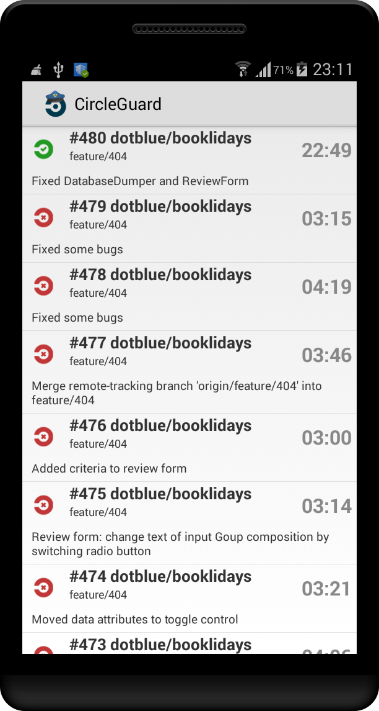

CircleGuard
===========

CircleGuard is Android application to watch (and later also manage) your [CircleCI](https://circleci.com) builds.

Current features
----------------

* List builds and display its status and elapsed times

Planned features

* Open build detail
* Manage builds (cancel, rerun)
* Notifications via GCM (all/failed/fixed - depending on settings)

Current appearance
-------------------

Used libraries [for versions see [build.gradle](app/build.gradle)]
--------------

* RoboSpice [Core, RoboSpice Spring Android, RoboSpice Json]
